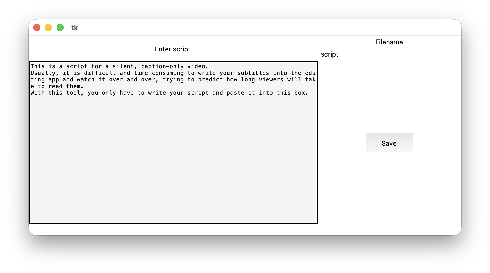
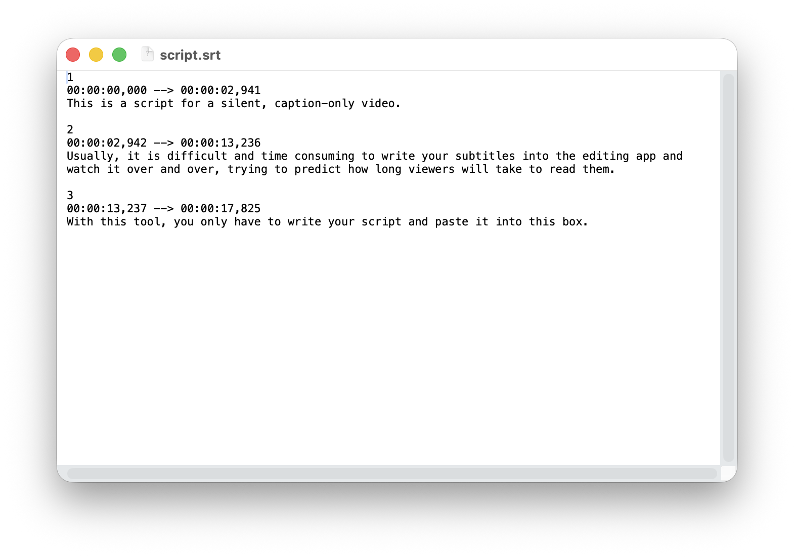

# silent-video-subtitle-maker
A helpful tool for caption-only video content that splits a written script into properly timed subtitles (.srt) based on realistic reading speed.

# Usage

*The main interface showing script input and subtitle preview*

*The resulting .srt file generated by the program*